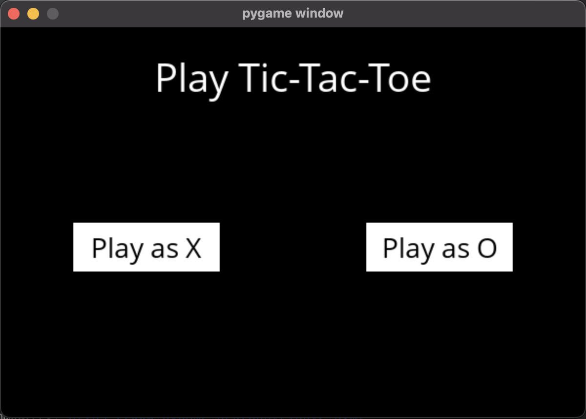
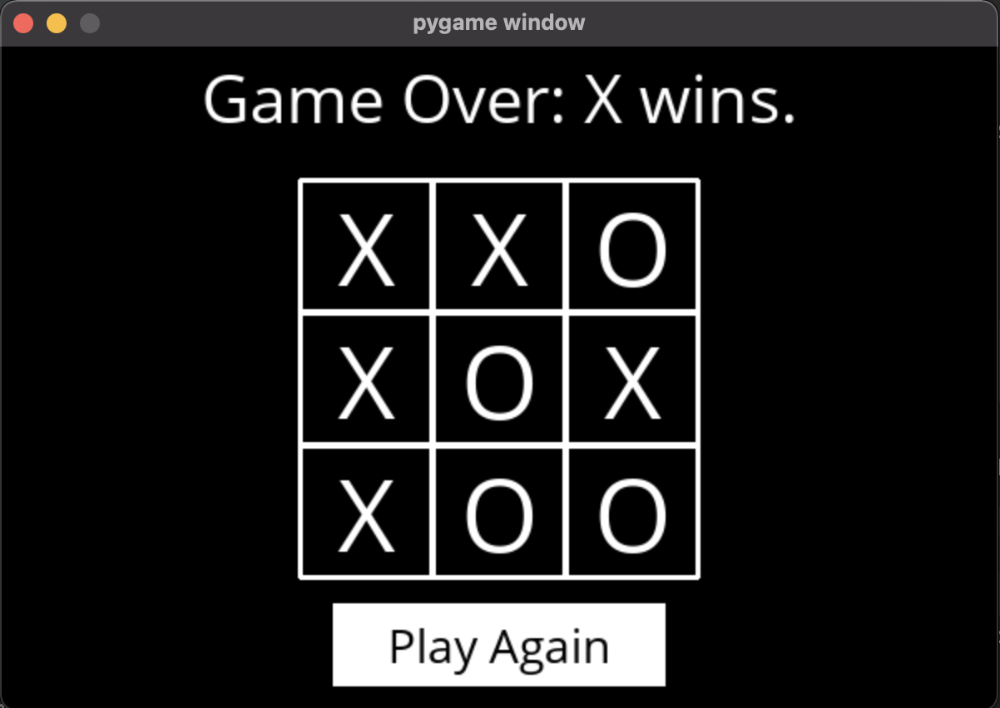

# TicTacToe-AI
*****
Artificial Intelligence Model made with MinMax Algorithm and optimized using Alpha-Beta Pruning. PyGame implementation of the AI algorithm.

***Try to beat the unbeatable AI. Bet if you can even win.***
*****
## Install Dependencies
```python
pip install -r requirements.txt
```

## To run the AI and game. Execute following commands on terminal.
```python
python3 runner.py
```
*****
## Current UI
**Welcome Page**



**End Game**



### References:
[Minimax Algorithm](https://towardsdatascience.com/understanding-the-minimax-algorithm-726582e4f2c6)
